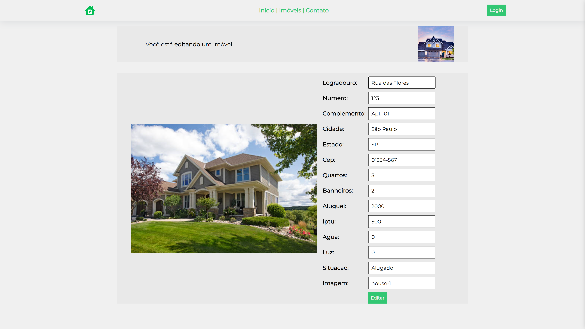

# CRUD Application - Real Estate 

A simple CRUD (Create, Read, Update, Delete) application for managing real estate properties.

## Live Access - Coming Soon

You'll be able to access the live version of this application soon.

## Functionality

- Create, Read, Update, and Delete property records.
- Fields: property type, location, price.

## Screens

- Login

- Home Page

- Control Panel

- Inserting

- Editing

- Viewing

## Technologies Used

- Frontend: HTML, CSS
- Backend: PHP
- Database: MySQL

## Setup Instructions

1. Clone the repository.

2. Import the provided `properties.sql` file into your Oracle database.

3. Configure the database connection in `config.php` (backend directory) with your Oracle SQL credentials.

4. Start a local PHP server.

5. Access the application in your browser at `localhost/folder`.

## License

This project is licensed under the [MIT License](LICENSE).
